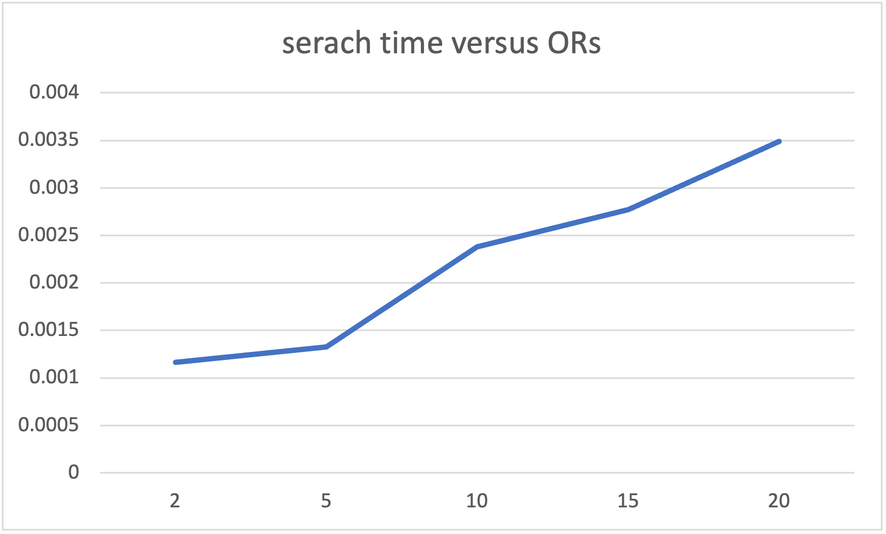

# dbms-a2

author: Nguyen (Will), Xiaochen

## Compile
    $ g++ -I./include/ -L./.libs/ -l xapian -o metadata_indexer metadata_indexer.cc
    $ g++ -I./include/ -L./.libs/ -l xapian -o metadata_indexer metadata_indexer.cc
The executable files are `metadata_indexer` and `metadata_search`.

## Usage
    $ metadata_indexer <dataset_metadata> <index_name> <data_size>
    $ metadata_search <index_name> <top-k> <keyword1> <keyword2> ...

## Plots

### Indexing time versus data size:
* Vary the number of entries in the metadata file, and measure the respective indexing time. Consider the following corpus sizes: 500, 10000, ..., 40000.
  * Plot the indexing time (y-axis) versus the number of data sets indexed (x-axis).
  
    
    
### Search time versus data size:
  * Plot the search time (y-axis) versus the number of data sets in the index (x-axis). Consider the following corpus sizes: 500, 10000, ..., 40000.
  
    
    
    
    
    The keywords used in this activity is 
    
    People human +document +system
### Search time versus number of AND-keywords in the query:
  * Plot the search time (y-axis) versus the number of AND-terms in the query. Consider the following corpus sizes: 2, 5, 10, 15, 20.
  
    
    
    The keywords used in this activity is
    
    people human system document datasets number platform required awards primary life privacy permit service housing orders abandoned armed benefits establish
    
    
    
    Datasize is 40000
### Search time versus number of OR-keywords in the query:
  * Plot the search time (y-axis) versus the number of OR-terms in the query.
  
    
    
    The key words used in this activitly is 
    
    +people +human +system +document +datasets +number +platform +required +awards +primary +life +privacy +permit +service +housing +orders +abandoned +armed +benefits +establish
    
    Datasize is 40000
### Plot the top-K search time (y-axis) versus the cardinality of the query set. Consider K = 10.
* Plot:
    
        

### [Optional] Plot the top-K search time (y-axis) versus K for a query set. Consider the following K values: 2, 10, 20, 25, 40.
* Plot:
    

The result comes from 100 words generated.
